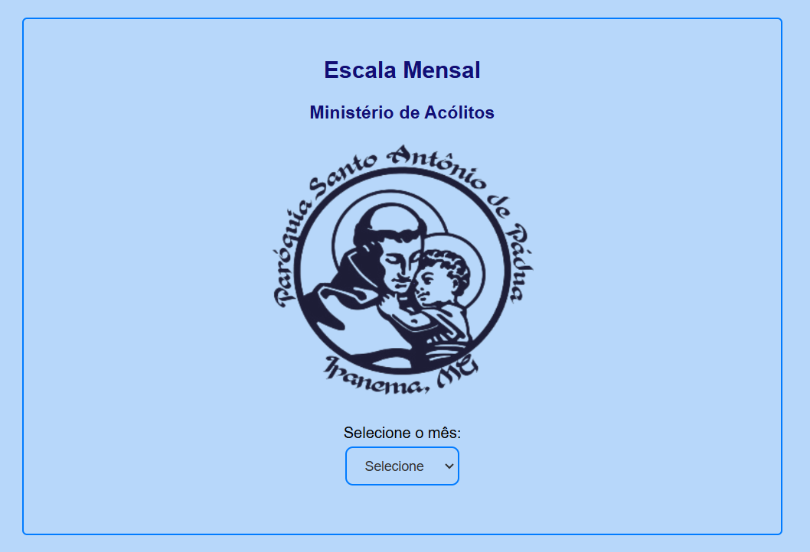
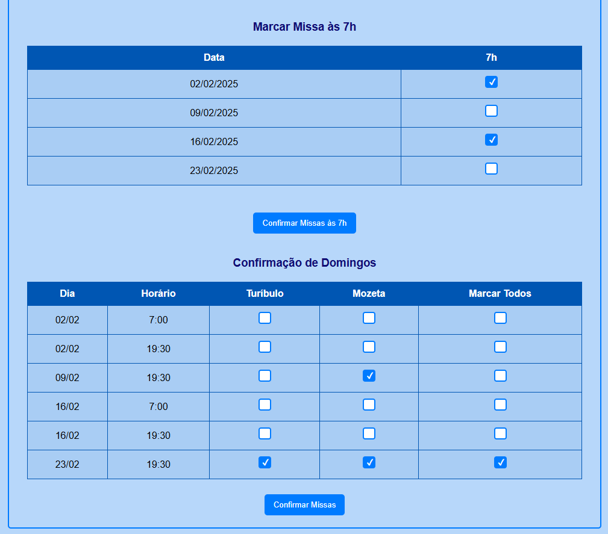
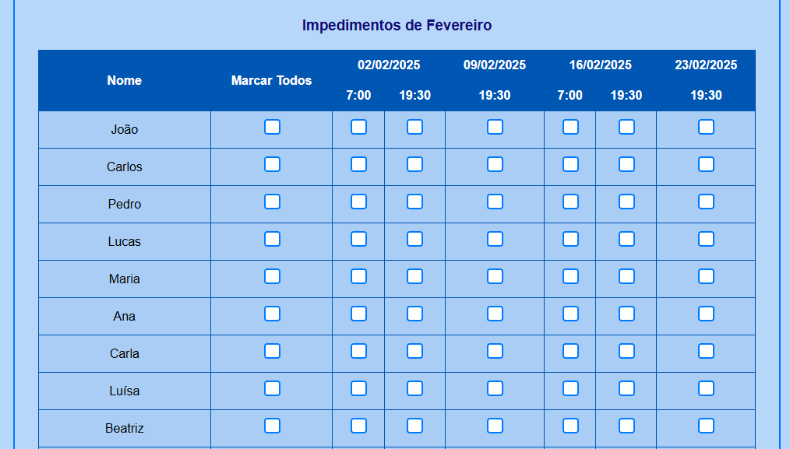
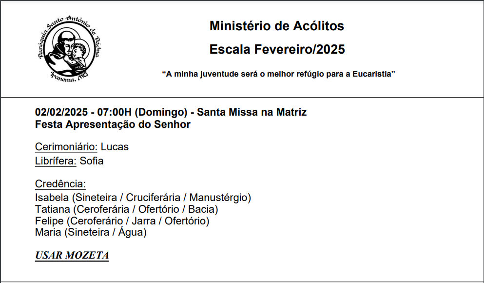

# EscalaAcolitos
Gerador de Escalas Mensais para Acólitos da Paróquia Santo Antônio de Pádua Ipanema-MG

- Geração Automática: Criação da escala com base nos impedimentos durante o mês.
- Balanceamento: Distribuição equilibrada das escalas para atender de forma justa a todos os acólitos.
- Consultas na API [https://liturgia.up.railway.app/01-01-2025] para identificar celebração dominical, ex: "Epifania do Senhor";

Disponível em: [https://igorp2.github.io/EscalaAcolitos/escala]

Imagens do projeto e escala gerada em PDF:

